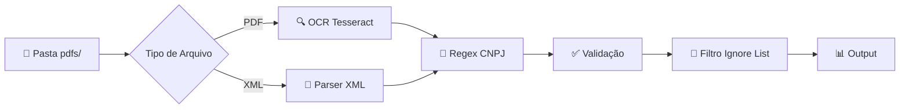

<h1 align="center">🤖 CNPJ Extractor Bot</h1>

<p align="center">
  <strong>Automação inteligente para extração e validação de CNPJs de notas fiscais eletrônicas</strong>
</p>

<p align="center">
  
  
  
  
</p>

<p id="licence" align="center">
  
  
</p>

---

<p align="center">
  
</p>

## 📋 Sobre o Projeto

O **CNPJ Extractor Bot** é uma ferramenta de automação desenvolvida em Python para extrair e validar **números de CNPJ** e **valores de notas fiscais** de documentos eletrônicos. Processa tanto arquivos **PDF** (usando OCR) quanto **XML** (NFSe - Nota Fiscal de Serviço Eletrônica).

<p align="center">
  
</p>

## ✨ Features

<table>
  <tr>
    <td align="center" width="33%">
      <br/>
      <b>Extração de CNPJ</b><br/>
      <sub>Regex avançado para múltiplos formatos</sub>
    </td>
    <td align="center" width="33%">
      <br/>
      <b>Validação Oficial</b><br/>
      <sub>Algoritmo brasileiro de dígitos verificadores</sub>
    </td>
    <td align="center" width="33%">
      <br/>
      <b>OCR em PDFs</b><br/>
      <sub>Tesseract para documentos escaneados</sub>
    </td>
  </tr>
  <tr>
    <td align="center" width="33%">
      <br/>
      <b>Parsing XML NFSe</b><br/>
      <sub>Suporte ao padrão ABRASF 2.04</sub>
    </td>
    <td align="center" width="33%">
      <br/>
      <b>Multi-Regional</b><br/>
      <sub>RJ, DF, SP e outros</sub>
    </td>
    <td align="center" width="33%">
      <br/>
      <b>Extração de Valores</b><br/>
      <sub>Captura automática de valores NF</sub>
    </td>
  </tr>
</table>

<p align="center">
  
</p>

##  Quick Start

### Pré-requisitos

```bash
# Instalar Tesseract OCR (Ubuntu/Debian)
sudo apt install tesseract-ocr tesseract-ocr-por tesseract-ocr-eng

# Instalar Poppler para pdf2image
sudo apt install poppler-utils
```

### Instalação

```bash
# 1. Clone o repositório
git clone https://github.com/seu-usuario/cnpj-extractor-bot.git
cd cnpj-extractor-bot

# 2. Crie um ambiente virtual (recomendado)
python -m venv venv
source .venv/bin/activate

# 3. Instale as dependências
pip install -r requirements.txt
```

### Uso

```bash
# Execute o bot
python main.py
```

O bot irá processar automaticamente todos os arquivos PDF e XML na pasta `pdfs/`.

<p align="center">
  
</p>


## Output 

O módulo `output_handler.py` oferece funcionalidades avançadas para processamento e organização de notas fiscais:

### ✨ Funcionalidades

- **📦 Criação de ZIPs individuais**: Cada arquivo (PDF ou XML) é compactado em seu próprio ZIP
- **🗂️ Estruturação de dados**: Extração estruturada de dados NFSe em dataclass
- **📊 Exportação CSV**: Relatório consolidado com campos essenciais das notas
- **🔍 Extração inteligente**: Parser XML para NFSe padrão ABRASF 2.04

### 🎯 Campos Extraídos (CSV)

| Campo | Descrição | Origem |
|-------|-----------|--------|
| `caminho_zip` | Caminho para o arquivo ZIP criado | Gerado automaticamente |
| `numero_nota` | Número da nota fiscal | `//InfNfse/Numero` |
| `valor_total` | Valor total da nota (R$) | `//Servico/Valores/ValorServicos` |
| `uf_prestador` | UF do prestador do serviço | `//PrestadorServico/Endereco/Uf` |
| `uf_tomador` | UF do tomador do serviço | `//TomadorServico/Endereco/Uf` |
| `cnpj_prestador` | CNPJ do prestador (14 dígitos) | `//Prestador/CpfCnpj/Cnpj` |
| `cnpj_tomador` | CNPJ do tomador (14 dígitos) | `//TomadorServico/IdentificacaoTomador/CpfCnpj/Cnpj` |
| `arquivo_origem` | Caminho do arquivo original | Arquivo processado |
| `data_emissao` | Data de emissão da nota | `//InfNfse/DataEmissao` |
| `razao_social_prestador` | Razão social do prestador | `//PrestadorServico/RazaoSocial` |
| `razao_social_tomador` | Razão social do tomador | `//TomadorServico/RazaoSocial` |
| `codigo_verificacao` | Código de verificação da nota | `//InfNfse/CodigoVerificacao` |

### 🚀 Como Usar

#### Execução Básica
```bash
# Apenas geração de outputs (ZIPs + CSV)
python3 main.py --output-only [pasta]

# Processamento completo (extração + outputs)
python3 main.py --output [pasta]
```

#### Uso Programático
```python
import output_handler

# Processar pasta e gerar outputs
invoices = output_handler.process_and_export("download")

# Extração de dados de XML específico
data = output_handler.extract_invoice_data_from_xml("nota.xml")
print(f"Invoice #{data.invoice_number}: R$ {data.total_value:,.2f}")
```

### 📂 Estrutura de Saída

```
output/
├── invoice_summary.csv          # Relatório consolidado CSV
└── zips/                       # ZIPs individuais
    ├── NotaFiscal_001.zip
    ├── NotaFiscal_002.zip
    └── ...
```

### ⚙️ Configuração

No arquivo [config.py](config.py):

```python
OUTPUT_FOLDER = "output"           # Pasta principal de saída
ZIP_FOLDER = "zips"               # Subpasta para ZIPs
CSV_FILENAME = "invoice_summary.csv"  # Nome do arquivo CSV
```

<p align="center">
  
</p>


## 🛠️ Tecnologias

<p align="center">
  
  &nbsp;&nbsp;
  
  &nbsp;&nbsp;
  
</p>

| Tecnologia | Versão | Descrição |
|:----------:|:------:|:----------|
| **Python** | 3.12+ | Linguagem principal |
| **Tesseract OCR** | - | Reconhecimento óptico de caracteres |
| **PyPDF2** | - | Extração de texto de PDFs |
| **pdfplumber** | 0.11.7 | Parsing avançado de PDF |
| **Pillow** | 11.3.0 | Processamento de imagens |

<p align="center">
  
</p>

## ⚙️ Configuração

### Lista de CNPJs Ignorados

O bot possui uma lista de CNPJs da HITSS que são automaticamente ignorados:

```python
CNPJ_IGNORE = ["11168199000188", "11168199000340", "11168199000269"]
```

### Formatos Regionais Suportados

| Região | Padrão de Busca |
|:------:|:----------------|
| 🏙️ **Rio de Janeiro** | `VALOR DA NOTA` |
| 🏛️ **Distrito Federal** | `Total dos Serviços` |
| 🌆 **Campinas** | `Base de cálculo do ISSQN` |

<p align="center">
  
</p>

## 📁 Estrutura do Projeto

```
hitss-billing-bot/
├── 📄 main.py                   # Ponto de entrada principal do bot
├── 📄 config.py                 # Configurações e constantes (CNPJs ignorados, padrões)
├── 📄 extractors.py             # Módulo de extração (PDF/XML, CNPJ, valores)
├── 📄 requirements.txt          # Dependências Python
├── 📄 README.md                 # Este arquivo
└── 📁 pdfs/                     # Pasta de entrada (PDFs e XMLs)
    ├── documento1.pdf
    └── documento2.xml
```

<p align="center">
  
</p>

## 🔄 Como Funciona



<p align="center">
  
</p>

## 🤝 Contribuição

Contribuições são bem-vindas! Sinta-se à vontade para:

1. 🍴 Fazer um Fork do projeto
2. 🔧 Criar uma Branch (`git checkout -b feature/AmazingFeature`)
3. 💾 Commit suas mudanças (`git commit -m 'Add some AmazingFeature'`)
4. 📤 Push para a Branch (`git push origin feature/AmazingFeature`)
5. 🔃 Abrir um Pull Request

<p align="center">
  
</p>

## 📝 Licença

Distribuído sob a licença MIT. Veja `LICENSE` para mais informações.

---

<p align="center">
  Desenvolvido pela Squad Customer Care
</p>

<p align="center">
  <a href="#-cnpj-extractor-bot">⬆️ Voltar ao topo</a>
</p>
